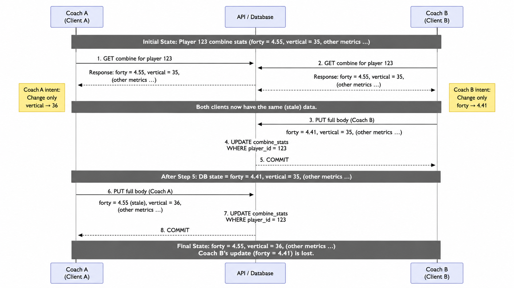
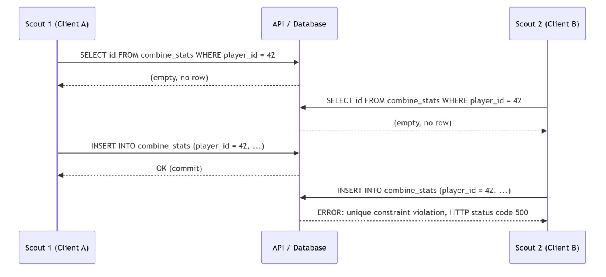
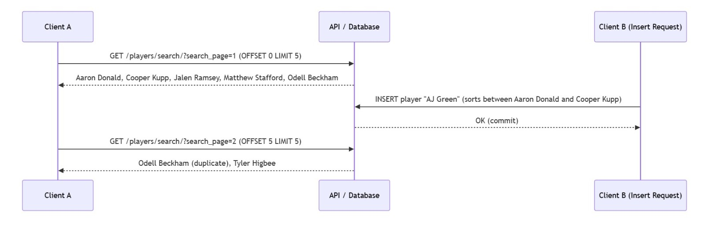

# Concurrency risks for NFL Player Stats API

NOTE: PostgreSQL defaults to READ COMMITTED for each engine.begin() transaction.

---

## Case 1: Lost update on `PUT /players/{player_id}/combine`

### Problem

This endpoint is vulnerable to a **lost update**.

A lost update happens when two people edit the same player's combine stats at about the same time, and one person's changes get overwritten by the other person's request.

Even though **both requests succeed** and return HTTP `200`, one update effectively disappears.

---

This becomes a problem when two users:

both load the same player's current combine stats
each change a different field locally
both send a full PUT request based on their own copy of the old data

Because the endpoint replaces the whole row, the last request to commit wins, even if it contains stale values in some fields.

---

## Example

Suppose the database currently has:

forty = 4.55
vertical = 35
Coach A wants to fix:
vertical = 36
Coach B wants to fix:
forty = 4.41

Both coaches first load the same old values:

forty = 4.55
vertical = 35

Then the requests happen:

Coach B sends:

forty = 4.41
vertical = 35

The database now becomes:

forty = 4.41
vertical = 35

Coach A later sends:

forty = 4.55  (stale old value)
vertical = 36

The database now becomes:

forty = 4.55
vertical = 36

So Coach B's update to forty is lost.
---
### Sequence Diagram:



---

### What I would add to isolate this case

The best fix for this codebase is to add a row lock before updating the player's combine row.

Inside the same transaction:

SELECT id
FROM combine_stats
WHERE player_id = :pid
FOR UPDATE;

Then perform the UPDATE:

This forces two writes to the same player's combine row to happen one at a time.
If one request is already updating that row, the second request has to wait until the first finishes.
That prevents two overlapping full row updates from silently overwriting each other.

Alternative fix: optimistic concurrency
Another option is to add a version or timestamp check.
For example, the client could send the recorded_at value it saw when it loaded the row. Then the UPDATE would only succeed if that timestamp still matches.
If the row has changed since the client last read it, the server could return a 409 Conflict
and tell the client to refresh and retry. This prevents stale client data from overwriting newer changes.

---

## Case 2: Race condition on `POST /players/{player_id}/combine`

### Problem

The `combine_stats` table has a unique constraint on `player_id`, so duplicate rows cannot be created. However, the endpoint uses a **check-then-act** pattern: it first SELECTs to see if a row exists, and only then INSERTs. Under Read Committed isolation, two simultaneous POST requests for the same player can both pass the existence check before either has committed. When both then attempt to INSERT, the unique constraint stops the second one, but the result is a raw database constraint error returned as an unhandled HTTP status code `500`, not the clean HTTP status code `409` the application is supposed to return.

The data stays correct, but the API behavior is broken for the losing request.

---

### Example

Two scouts submit combine stats for the same newly registered player at the same time.

Both requests read: no combine row exists for player 42
Both proceed to attempt an INSERT for player 42
Scout 1's INSERT commits successfully and returns HTTP status code `200`
Scout 2's INSERT hits the unique constraint and crashes with a raw DB error instead of a clean HTTP status code `409`

---

### Sequence Diagram



---

### What I would add to isolate this case

Replace the separate SELECT + INSERT with a single atomic `INSERT ... ON CONFLICT DO NOTHING RETURNING id`. The conflict detection happens inside the database engine with no race window:

```sql
INSERT INTO combine_stats (player_id, ...)
VALUES (:pid, ...)
ON CONFLICT (player_id) DO NOTHING
RETURNING id;
```

If `RETURNING id` returns nothing, the row already existed and the application returns HTTP status code `409`. No separate SELECT needed, no exception handling, and both concurrent requests get a proper HTTP response.

---

## Case 3: Phantom read across paginated requests on `GET /players/search/`

### Problem

The search endpoint uses `LIMIT/OFFSET` pagination. Each page request is its own independent transaction. If a player is inserted or deleted between two page requests, the row offsets shift. A player can **appear on two pages** or be **skipped entirely**. This is a **phantom read** at the application level.

The caller has no indication that the result set changed mid-pagination, so they may process a player twice or miss one without knowing.

---

### Example

Page size = 5. Players are sorted by name. The database currently has these 6 players in order:

| Row | Name |
|-----|------|
| 1 | Aaron Donald |
| 2 | Cooper Kupp |
| 3 | Jalen Ramsey |
| 4 | Matthew Stafford |
| 5 | Odell Beckham |
| 6 | Tyler Higbee |

Client A fetches page 1 (OFFSET 0 LIMIT 5) and receives rows 1-5 (Aaron Donald through Odell Beckham).

Meanwhile, Client B inserts a new player "AJ Green", which sorts between Aaron Donald and Cooper Kupp, shifting everyone down by one position.

| Row | Name |
|-----|------|
| 1 | Aaron Donald |
| 2 | AJ Green (new) |
| 3 | Cooper Kupp |
| 4 | Jalen Ramsey |
| 5 | Matthew Stafford |
| 6 | Odell Beckham |
| 7 | Tyler Higbee |

Client A fetches page 2 (OFFSET 5 LIMIT 5) and receives rows 6-7, which starts with Odell Beckham again. Client A has now seen Odell Beckham twice and never sees AJ Green or Tyler Higbee together cleanly.

---

### Sequence Diagram



---

### What I would add to isolate this case

Switch from offset-based pagination to **keyset (cursor) pagination**. Instead of `OFFSET`, the client passes the `name` and `id` of the last seen player and the query uses `WHERE p.name > :last_seen_name OR (p.name = :last_seen_name AND p.id > :last_seen_id)`. Because the cursor is tied to a stable row value rather than a positional offset, inserts and deletes do not shift the window:

```sql
SELECT p.id, p.name, ...
FROM "Players" p
LEFT JOIN combine_stats c ON c.player_id = p.id
WHERE p.name > :last_seen_name
   OR (p.name = :last_seen_name AND p.id > :last_seen_id)
ORDER BY p.name ASC, p.id ASC
LIMIT :limit;
```

The cursor is a `(name, id)` pair. The primary sort is by name; `id` is only a tiebreaker for players who share the same name. The size of `id` does not matter since it never drives the sort order on its own. This does not require changing the isolation level. It eliminates the phantom by making the pagination anchor stable rather than position-dependent.