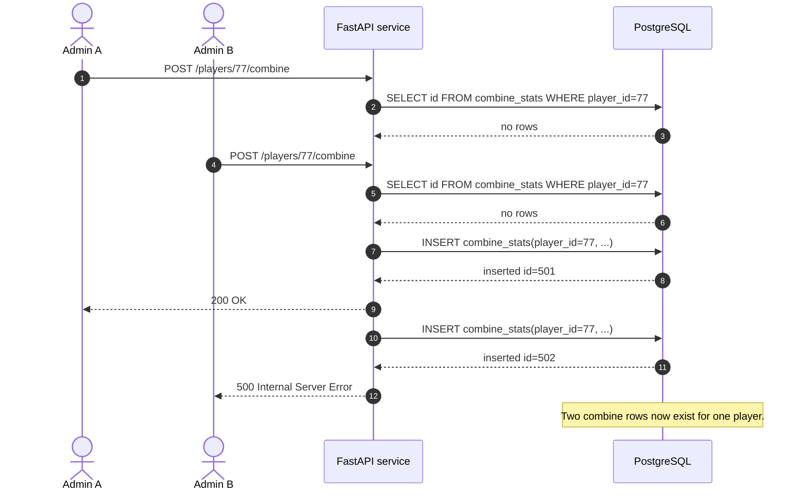

# Concurrency risks for NFL Player Stats API

NOTE: PostgreSQL defaults to READ COMMITTED for each engine.begin() transaction.

---

## Case 1: Lost update on `PUT /players/{player_id}/combine`

### Problem

This endpoint is vulnerable to a **lost update**.

A lost update happens when two people edit the same player's combine stats at about the same time, and one person's changes get overwritten by the other person's request.

Even though **both requests succeed** and return HTTP `200`, one update effectively disappears.

---

This becomes a problem when two users:

both load the same player's current combine stats
each change a different field locally
both send a full PUT request based on their own copy of the old data

Because the endpoint replaces the whole row, the last request to commit wins, even if it contains stale values in some fields.

---

## Example

Suppose the database currently has:

forty = 4.55
vertical = 35
Coach A wants to fix:
vertical = 36
Coach B wants to fix:
forty = 4.41

Both coaches first load the same old values:

forty = 4.55
vertical = 35

Then the requests happen:

Coach B sends:

forty = 4.41
vertical = 35

The database now becomes:

forty = 4.41
vertical = 35

Coach A later sends:

forty = 4.55  (stale old value)
vertical = 36

The database now becomes:

forty = 4.55
vertical = 36

So Coach B's update to forty is lost.
---
### Sequence Diagram:


---

### What I would add to isolate this case

The best fix for this codebase is to add a row lock before updating the player's combine row.

Inside the same transaction:

SELECT id
FROM combine_stats
WHERE player_id = :pid
FOR UPDATE;

Then perform the UPDATE:

This forces two writes to the same player's combine row to happen one at a time.
If one request is already updating that row, the second request has to wait until the first finishes.
That prevents two overlapping full row updates from silently overwriting each other.

Alternative fix: optimistic concurrency
Another option is to add a version or timestamp check.
For example, the client could send the recorded_at value it saw when it loaded the row. Then the UPDATE would only succeed if that timestamp still matches.
If the row has changed since the client last read it, the server could return a 409 Conflict
and tell the client to refresh and retry. This prevents stale client data from overwriting newer changes.

---

## Case 2: Duplicate combine row on concurrent `POST /players/{player_id}/combine`

### Problem

**Check-then-insert race / phantom insert** occurs when two requests both check that no combine row exists for a player, both see nothing, and both insert a row.

The `POST /players/{player_id}/combine` endpoint first runs:

```sql
SELECT id FROM combine_stats WHERE player_id = :pid
```

If no row exists, it then runs an `INSERT INTO combine_stats (...) VALUES (...) RETURNING id`.

Since we already have a table-level uniqueness rule on the player_id,

```python
    op.create_table(
        "combine_stats",
        sa.Column("id", sa.Integer(), primary_key=True),
        sa.Column(
            "player_id",
            sa.Integer(),
            sa.ForeignKey("Players.id", ondelete="CASCADE"),
            nullable=False,
            unique=True,
        ),
    )
```
one entry will get a 500 error, while the other will be successfully inserted (200).


### Example

Player 77 has no combine stats yet. Two admins submit combine stats around the same time.

A race happens that causes one request to fail, not a duplicate-row anomaly

```text
Request A checks: no combine row exists for player 77
Request B checks: no combine row exists for player 77
Request A inserts combine row for player 77 and commits
Request B tries to insert combine row for player 77
Database rejects Request B with unique-constraint violation
```
That means the database preserves correctness, but the admin who issues Request B will be confused about what happened.

### Sequence diagram



### Isolation fix

The service needs to handle the conflict cleanly.

Catch failure of insertion in python code:

```python
result = connection.execute(
    sqlalchemy.text(
        """
        INSERT INTO combine_stats (
        ...
        """
    ),
).scalar_one()
if result is not None:
    raise HTTPException(
        status_code=status.HTTP_409_CONFLICT,
        detail="Combine stats already exist for this player. Use PUT to update.",
        )
```

For the current API semantics, `409 Conflict` is the better match because the endpoint already says, "Combine stats already exist for this player. Use PUT to update."

---

